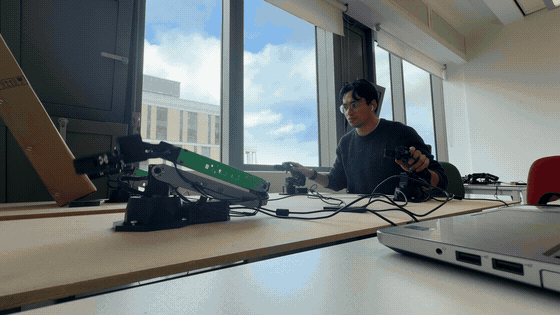
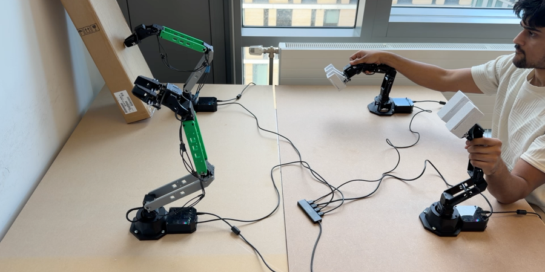

  

I'm a Computer Science student at the University of Edinburgh, and I like building things that make abstract ideas feel physical: robot arms you can actually push against, whiteboards you can talk to, and little public-data monitors for problems that are easy to hand-wave past.

I co-founded [EdinburghAI](https://www.edinburghai.org), spent time as an AI Engineer Intern at [V7 Labs](https://www.v7labs.com), and have a habit of saying yes to hackathons when I probably should be sleeping.

## Recently

  

- **Sensorless bilateral teleoperation.** I built a low-cost dual-arm teleoperation system with custom 2x-scaled 3D-printed follower arms and force feedback using only motor current. [Repo](https://github.com/theCampel/sensorless-bilateral-teleop) / [Project page](https://leocamacho.co/teleop) / [DOI](https://doi.org/10.13140/RG.2.2.31526.28487)
- **Realtime speech-to-whiteboard.** Speak a system architecture and watch it become an editable tldraw diagram through the OpenAI Realtime API. [Repo](https://github.com/theCampel/realtime-whiteboard) / [Demo](https://youtu.be/7tANdJDI4sg)
- **The missing first rung.** A public-data economics paper on whether AI-exposed occupations are tilting away from young workers before headline unemployment moves. [Paper](https://leocamacho.co/papers/first-rung-public.pdf) / [Interactive essay](https://transition.leocamacho.co) / [DOI](https://doi.org/10.13140/RG.2.2.31316.56966)

## Robot Stuff

  

The current robotics obsession is cheap bilateral teleoperation: taking commodity robot arms, custom printed links, a ROS 2 stack, and motor-current signals, then asking how far you can get before the physics starts arguing back.

The short answer: far enough to feel contact, not far enough to pretend gravity and collisions are the same problem.

## Other Things I Like Building

- AI agents and interfaces that are useful immediately, not only as demos.
- Tools for students, including EdinburghAI workshop materials and a University of Edinburgh grade calculator.
- Weird little product prototypes: AI radio, voice interfaces, prediction markets, whiteboards, dashboards.
- Writing about AI, labour markets, robotics, and the bits of transition that are easy to miss.

## Tools I Keep Reaching For

Python, TypeScript, React, ROS 2, LaTeX, Jupyter, FastAPI, Next.js, and whatever gets the prototype over the line fastest.

## Fancy A Chat?

I love an excuse to get coffee.

- Website: [leocamacho.co](https://www.leocamacho.co)
- Writing: [leocamacho.co/essays](https://www.leocamacho.co/essays)
- LinkedIn: [leo-camacho](https://www.linkedin.com/in/leo-camacho/)
